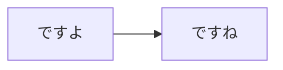

# mpc-api
SpringBootの最小をもう一度
## GETメソッドは
```
http://[host]:[port]/getList?name=[適当な字]
```
です
## POSTメソッドは
curlなら
```
curl -X POST -H "Content-Type: application/json" http://[host]:[port]/setListPost -d "{\"id\": \"3\", \"name\": \"aaa\", \"content\": \"www\"}"
```
です

{"id":4, "name": "名前", "content": "適当"}

src\main\resources\send.json に構造かいてます


